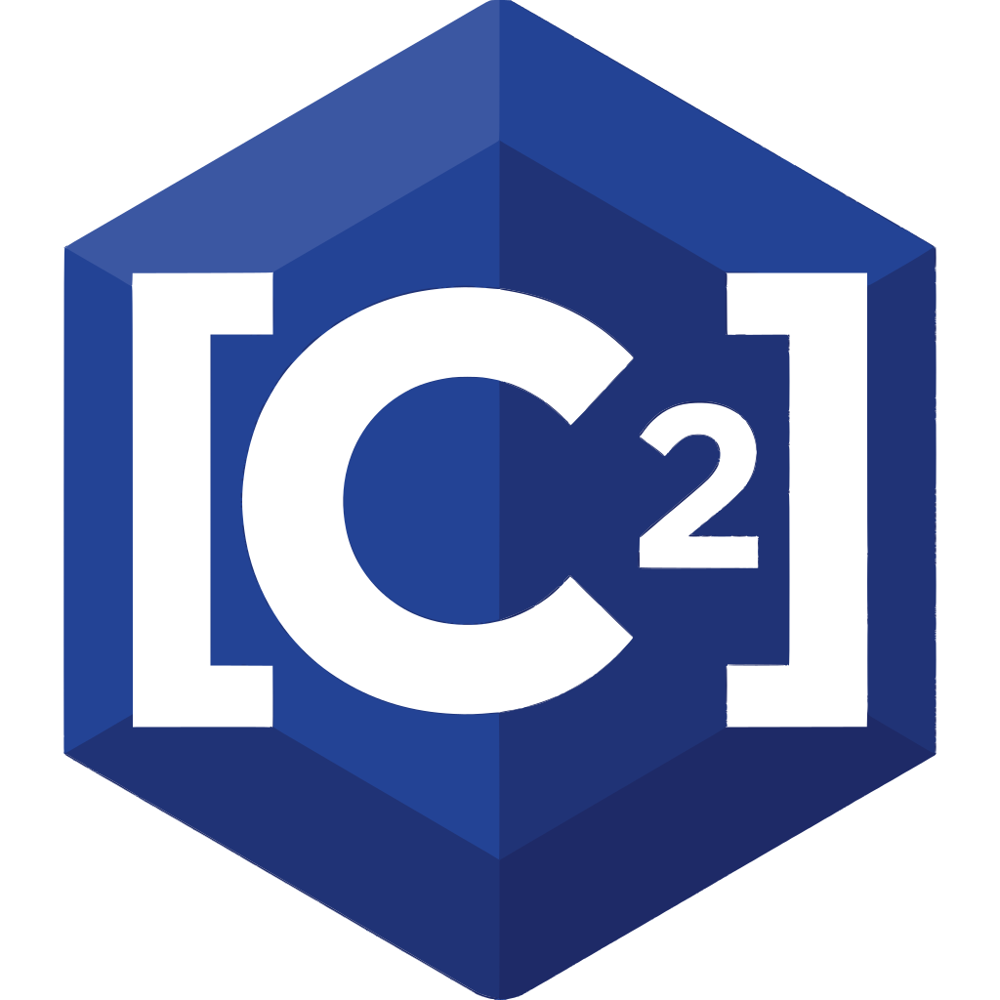

# C² (Contract Enforced C, Squared with Brackets)

<p align="center">
  
</p>

<p align="center">
  <em>Meet <strong>Cobb</strong>, the C² mascot</em><br>
  
</p>

**Compile-time verified contracts, automatic memory management, and program synthesis for C.**

C² is a C-to-C semantic transpiler (the `c2c` compiler) that extends standard C23 with mathematically proven safety guarantees — without runtime overhead, garbage collection, or sacrificing C ABIs.

```
[c2 source]  ─→  c2c  ─→  Z3 SMT Verifier  ─→  Borrow Checker  ─→  C Codegen  ─→  GCC/Clang
```

## Features

- **Contracts** — Declare preconditions and postconditions. The Z3 solver proves them at compile time or rejects your build with a precise error.
- **Bounds safety** — Array accesses are statically verified; buffer overflows become compile-time errors.
- **Borrow checking** — Lexical ownership tracking prevents use-after-free, double-free, and mutation-during-borrow at compile time.
- **Automatic drop** — Destructors are surgically injected at scope boundaries. No `free()` calls needed.
- **Program synthesis** — Write input-output examples and let the compiler generate the implementation.
- **Verified optimization hints** — Proven non-aliasing pointers get `restrict`, proven bounds emit `__builtin_unreachable()`.
- **Zero overhead** — All checks happen at compile time. The emitted C code is clean, standard, and optimal.
- **Drop-in C ABI** — C² programs link against any existing C library. No FFI, no runtime.
- **Self-hosting** — The C² compiler is written in pure C and will eventually compile itself.

## Quick Start

```bash
# Build the c2c compiler
make

# Build a C² program (transpile + compile to binary)
./build/c2c build examples/swap_bytes.c2 -o swap_bytes

# Verify contracts only
./build/c2c check examples/swap_bytes.c2

# Transpile to C only
./build/c2c build examples/swap_bytes.c2 --emit-c

# Synthesize implementations from examples
./build/c2c derive examples/draft.c2
```

## Example

```c
import "c2.h"

[denom != 0][result == num / denom]
int32_t divide(int32_t num, int32_t denom) {
    return num / denom;
}

typedef struct [[c2::drop(free_vector)]] {
    int32_t* data;
    int32_t size;
} Vector;

void free_vector(Vector* vec) {
    free(vec->data);
    vec->data = NULL;
    vec->size = 0;
}

int32_t main(void) {
    Vector vec = { malloc(10 * sizeof(int32_t)), 10 };
    // vec is automatically freed here — no explicit free() needed
    return 0;
}
```

## Project Status

Pre-alpha. The compiler is being written in pure C23. See [docs/spec.md](docs/spec.md) for the full language specification.

## License

TBD — to be determined before first public release.
